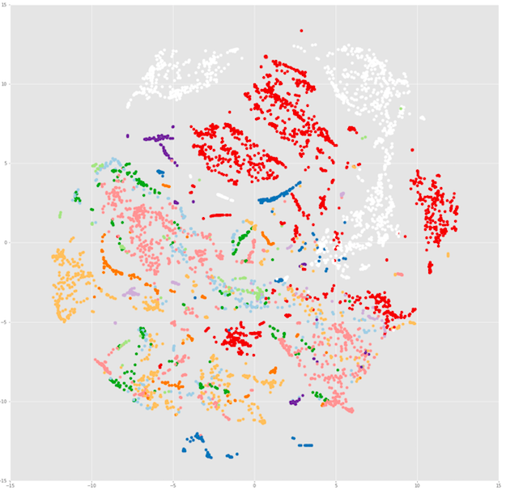
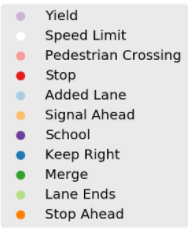

# Sign Edge

### Overview:
This is a project to create a machine learning method for classification of the type of street sign that is shown in a image. The method will use transfer learning from a pre-trained convolutional neural network and training a classification model on the features obtained.

In general, training a good neural network to do image classification can take a lot of time and resources. Luckily there exists extremely complex networks that have been pre-trained to classify many different items. But what happens when we want to use this method on something the neural network has never seen before? It wouldn't be able to make these classifications.

This is where transfer learning comes in. Transfer learning is an extremely powerful tool in machine learning when it comes to utilizing neural networks. By passing an image through the network without retraining it, but stopping it before making its classification prediction, you can extract features that the network thought were important enough about your image. You can then train a classification model on these features with good results.

### Business Understanding:
There is always need for new methods in recognition and classification of symbols and street signs for a number of uses including: self driving cars, street mapping, and driver safety systems. Classification has been done before, but there are no references that can be found for utilizing a transfer learning from a pre trained neural network. I believe that using a transfer learning method can greatly increase build time and would benefit smaller companies interested in these markets.

### The Data Preparation:
The data used in this demonstration is the LISA traffic sign dataset that can be found [here](http://cvrr.ucsd.edu/LISA/lisa-traffic-sign-dataset.html).

* As the image set is too large for this repo, the images are stored and accessed through AWS S3 bucket. The dataset comes with annotations for the location of signs within each image. A script, [here](https://github.com/theastrocat/signclassification/blob/master/src/awstools/aws_image_helper.py), was created pull the images from the LISA file system and upload them to S3 Bucket as well as save a JSON file with file name, original path, bounding boxes, and sign label.

* A script was created [here](https://github.com/theastrocat/signclassification/blob/master/src/awstools/LISA_aws_tools.py) to pull each image from the bucket as well as the image dictionary created in the previous step, crop the images, pad them with black to square and then put them back on S3. The script has a lower threshold for images (12x12 pixels).

The 15 most populous classes were selected with about 5500 total images ranging from 12x12 to ~150x150 pixels. The classes are fairly unbalanced with stop signs making up the majority of the dataset.

### Modeling steps:
* Using the cropped images dictionary created in the above steps, a train/test split is made using [this](https://github.com/theastrocat/signclassification/blob/master/src/awstools/LISA_train_test.py) script.

* The cropped images were passed through Inception V3 ([here](https://github.com/theastrocat/signclassification/blob/master/src/awstools/aws_feature_extraction.py)) and the bottleneck feature was extracted, which is a 2048 dimensional vector per image, and saved on S3.

* A [multinomial logistic regression](https://github.com/theastrocat/signclassification/blob/master/webapp/src/lrprobfinder.py) classifier was fit to the extracted features and [saved](https://github.com/theastrocat/signclassification/blob/master/webapp/build_classification_model.py) as a pickle.

### Web Application:
A web application was deployed utilizing the pickled model as well as extracted test features to make predictions on random images from the test set at: signedge.astrocat.space

### Outcome:
* Modeling resulted in a ~94% accuracy, and ~0.2 log-loss under 5-fold cross validation.

### Feature Visualization:
* [TSNE](https://en.wikipedia.org/wiki/T-distributed_stochastic_neighbor_embedding) dimensionality reduction was done on the feature space get a better sense of at the stratification of the classes.

### Next Steps:
 Using the [LIME method](https://homes.cs.washington.edu/~marcotcr/blog/lime/) for explanation of where the predictive power comes from in my image set.

### Citations:
LISA Dataset:
> Andreas Møgelmose, Mohan M. Trivedi, and Thomas B. Moeslund, "Vision based Traffic Sign Detection and Analysis for Intelligent Driver Assistance Systems: Perspectives and Survey," IEEE Transactions on Intelligent Transportation Systems, 2012.
